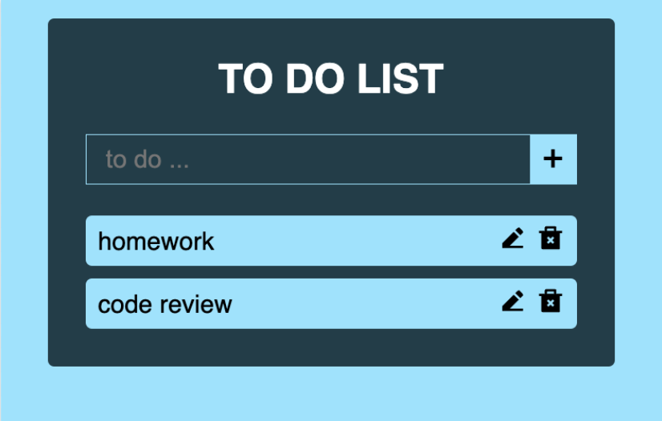

# To-Do List Application
### Overview
This project involves the development of a web-based To-Do List application designed to streamline task management through seamless CRUD (Create, Read, Update, Delete) operations. The application enhances user productivity by offering an intuitive interface for adding, viewing, updating, and deleting tasks.


### Objectives
The primary goal of this project is to create a reliable and user-friendly To-Do List application by integrating Flask for backend functionality, MongoDB Atlas for cloud-based data storage, and HTML templates for frontend design.

### Technologies and Frameworks 
- **Flask**: Backend framework for managing routes and logic.  
- **MongoDB Atlas**: Cloud-based database service for efficient data storage and retrieval.  
- **HTML/CSS**: Frontend design to create an intuitive user interface.

### Features
1. **Task Management**: Add, update, view, and delete tasks with ease.
2. **Cloud-Based Storage**: Utilize MongoDB Atlas to store task data securely.
3. **Responsive UI**: Enhance user experience with dynamic and clean HTML templates.

### How to Build and Run 
1. Install dependencies:
    ```bash
    pip install -r requirements.txt
    ```
2. Set up MongoDB Atlas:
    * Log in to your Atlas account
    * Navigate to your cluster and click "Connect"
    * Select "Connect your application" to generate a connection string

3. Configure the application:
    * Use the connection string to create a MongoDB client object in your Flask app
    * Specify the database and collection for storing tasks

4. Run the Flask application:
    ```bash
    python app.py
    ```
5. Open the application:
    Access the web app in your browser at http://localhost:3000.

### Results
1. **Streamlined Task Management**: Tasks can be added, updated, viewed, and deleted easily.
2. **Reliable Data Storage**: MongoDB Atlas ensures secure and scalable data handling.
3. **Intuitive Interface**: A simple, clean UI improves task organization and productivity.

### Conclusion
The To-Do List application demonstrates the effectiveness of combining Flask, MongoDB Atlas, and HTML templates to create a robust solution for task management. It provides a solid foundation for future enhancements and scalability.

### Future Work
1. Implement user authentication for personalized task lists.
2. Add deadline reminders and notifications for better task tracking.
3. Enhance the interface with advanced frontend frameworks like React or Vue.js.
